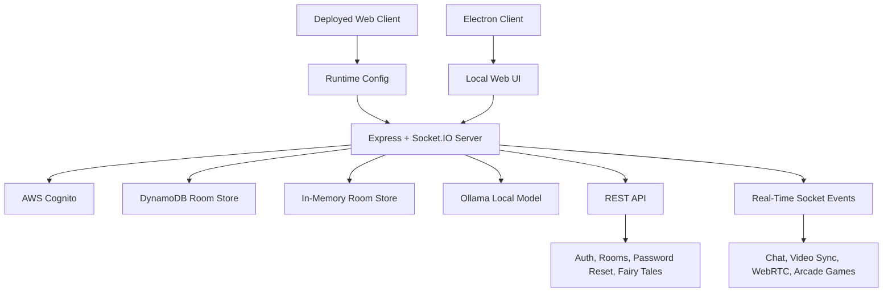

# NestSync

NestSync is a shared remote-presence app for families. It combines synchronized video playback, real-time chat, room-based mini-games, fairy tales, and video calling so a parent and child can stay engaged from different devices.

## Features

| Area | Description |
| --- | --- |
| Synchronized cinema | Load a YouTube video and keep play, pause, and seek actions in sync across the room. |
| Rooms and chat | Create a protected room, join it from another device, and exchange real-time messages. |
| Video calling | Use WebRTC signaling through Socket.IO for parent-child video calls. |
| Arcade | Play room-based games including Pictionary, Sudoku, Link Match, Quick Boat, and Love Letter. |
| Fairy tales | Read built-in illustrated stories and generate AI fairy tales through a local Ollama model. |
| Role-aware access | Parent and child roles are enforced for room creation, playback control, and feature access. |

## Tech Stack

- Frontend: Electron, HTML, CSS, vanilla JavaScript
- Backend: Node.js, Express, Socket.IO
- Authentication: AWS Cognito
- Room storage: in-memory by default, DynamoDB when configured
- AI story generation: Ollama-compatible local model
- Testing: Jest
- Deployment: Railway for the backend, Vercel for the web client

## Architecture



## Repository Layout

```text
NestSync/
├── client/
│   ├── games/
│   ├── images/
│   ├── scripts/
│   ├── ai-fairytale.js
│   ├── index.html
│   ├── main.js
│   ├── renderer.js
│   ├── runtime-config.js
│   ├── style.css
│   └── styles.css
├── docs/
├── server/
│   ├── __tests__/
│   ├── games/
│   ├── src/
│   ├── .env.example
│   ├── Dockerfile
│   └── server.js
├── railway.json
└── README.md
```

## Local Setup

### Requirements

- Node.js 18 or newer
- npm
- An AWS Cognito user pool and app client
- AWS credentials available on the machine for Cognito-backed register, login, and password reset flows

Optional:

- DynamoDB tables for persistent rooms and messages
- Ollama with a local model such as `phi3:mini` for AI fairy tale generation

### Install Dependencies

```bash
npm install
cd server
npm install
cd ../client
npm install
```

### Configure the Server

Create `server/.env` from `server/.env.example`.

```bash
cd server
cp .env.example .env
```

Set the required Cognito values in `server/.env`:

- `AUTH_MODE=cognito`
- `COGNITO_REGION`
- `COGNITO_USER_POOL_ID`
- `COGNITO_APP_CLIENT_ID`
- `COGNITO_ISSUER`

Optional server settings:

- `CORS_ORIGINS` for allowed browser origins
- `ROOM_STORE`
- `DYNAMODB_ROOMS_TABLE`
- `DYNAMODB_MESSAGES_TABLE`
- `PORT` or `LEGACY_SERVER_PORT`
- `AI_STORY_MODEL`

If DynamoDB table names are omitted, the app uses the in-memory room store.

### Run the App

Start the backend first:

```bash
cd server
npm start
```

Then start the Electron client in a second terminal:

```bash
cd client
npm start
```

Local defaults:

- Backend and local web UI: `http://localhost:3000`
- Electron client loads the local UI and can forward requests to a remote API base when `NESTSYNC_API_BASE` is set

## AI Fairy Tales

The AI story endpoints use a local Ollama model. If you want this feature, start Ollama and make sure the configured model is installed.

Example:

```bash
ollama pull phi3:mini
```

Available endpoints:

- `GET /api/ai-fairytale/model`
- `POST /api/ai-fairytale/generate`

## Tests

Server tests live in `server/__tests__/`.

```bash
cd server
npm test
```

The current test suite covers authentication-related services and room logic without requiring live AWS or database resources.

## Deployment

### Railway Backend

- Service root: repository root
- Build configuration: `railway.json`
- Runtime image: `server/Dockerfile`
- Health endpoint: `GET /healthz`

Recommended Railway environment variables:

- `AUTH_MODE`
- `COGNITO_REGION`
- `COGNITO_USER_POOL_ID`
- `COGNITO_APP_CLIENT_ID`
- `COGNITO_ISSUER`
- `ROOM_STORE`
- `DYNAMODB_ROOMS_TABLE`
- `DYNAMODB_MESSAGES_TABLE`
- `CORS_ORIGINS`

### Vercel Frontend

- Project root: `client`
- Build command: `npm run build:web`
- Required environment variable: `NESTSYNC_API_BASE=https://your-backend-domain`

`client/runtime-config.js` is generated during the web build so the deployed frontend can talk to the Railway backend.

## API Summary

| Method | Path | Purpose |
| --- | --- | --- |
| POST | `/api/register` | Register a parent or child user in Cognito |
| POST | `/api/login` | Sign in with username or email and password |
| POST | `/api/password/forgot` | Start the password reset flow |
| POST | `/api/password/reset` | Confirm the password reset with a code |
| GET | `/me` | Read the authenticated user profile |
| POST | `/api/rooms` | Create a room as a parent |
| POST | `/api/rooms/:roomId/join` | Join a room as a parent or child |
| GET | `/api/rooms/:roomId/meta` | Check room metadata |
| GET | `/api/rooms/:roomId/messages` | Read room message history |
| GET | `/healthz` | Health check |
| GET | `/health/auth` | Auth-route health check |

## Real-Time Events

Primary Socket.IO events include:

- Room lifecycle: `join-room`, `room-joined`, `leave-room`
- Chat: `chat-message`
- Video sync: `load-video`, `play-video`, `pause-video`, `seek-video`
- WebRTC signaling: `webrtc-offer`, `webrtc-answer`, `webrtc-ice-candidate`
- Arcade events for Pictionary, Sudoku, Link Match, Quick Boat, and Love Letter

## Notes

- Authentication is Cognito-based in the current implementation.
- The backend serves static client assets when the `client` directory is available.
- Room persistence switches automatically to DynamoDB when both room and message table names are configured.

See [docs/cloud-deploy-checklist.md](/Users/bruceyu/Desktop/NestSync/docs/cloud-deploy-checklist.md) and [docs/dynamodb-nestsync.md](/Users/bruceyu/Desktop/NestSync/docs/dynamodb-nestsync.md) for deployment and storage details.
